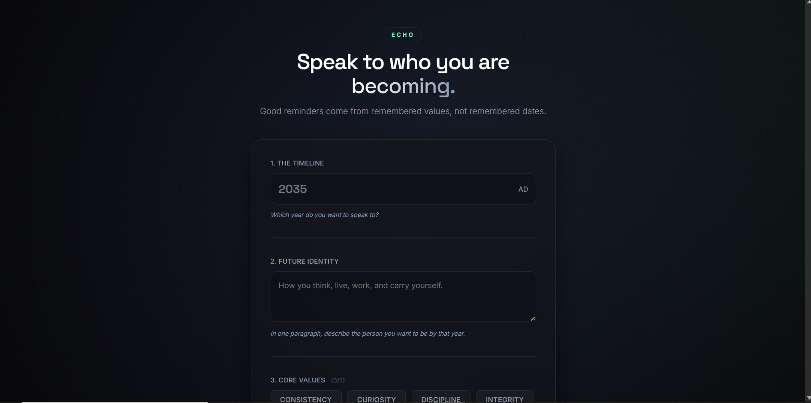
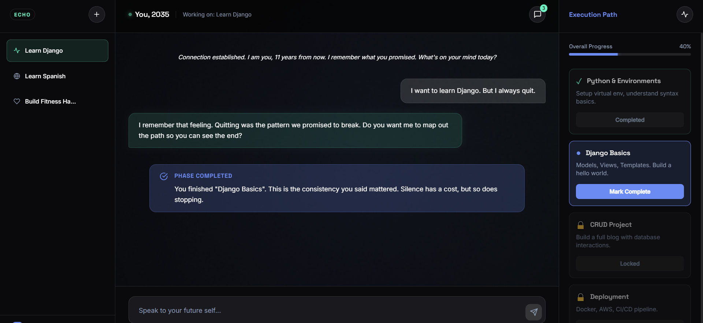
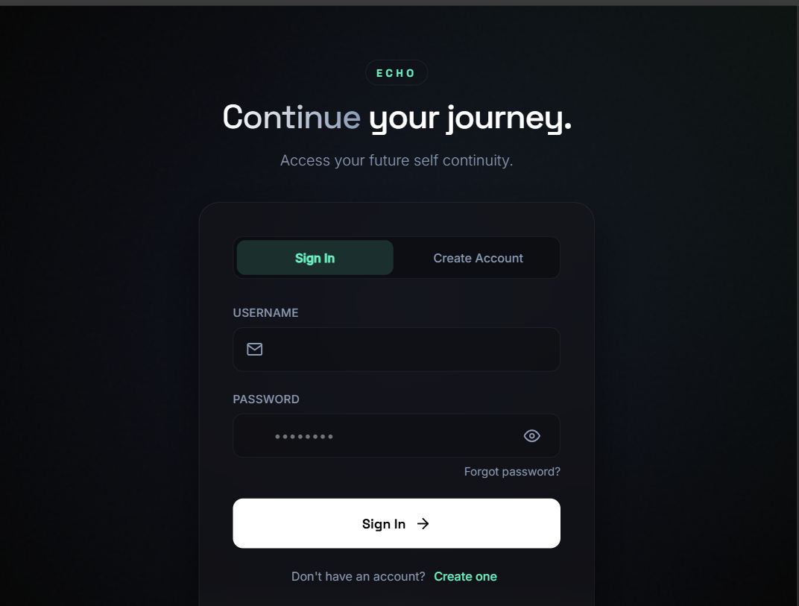

f# Echo 🌌  
Your future self — already waiting to talk to you.

> “The contract between Present-You and Future-You.”

Echo is a private AI space where you speak with a version of yourself years from now.  
Not a todo app. Not a coach yelling at you.  
Just a quiet, honest mirror — grounded in who you said you wanted to become.

## The real difference

| Most productivity tools                  | Echo                                      |
|------------------------------------------|-------------------------------------------|
| Obsessed with the next action            | Obsessed with the person you're becoming  |
| Reminds you what you haven't done        | Reminds you who you said you would be     |
| Creates pressure & guilt                 | Creates clarity & alignment               |
| Lives in calendars and lists             | Lives in values, identity, long-term meaning |

## What Echo actually does

- Lets you define your **FutureProfile**  
  → target year, core identity, values, deepest reasons

- Builds **phased roadmaps** through the Builder Agent  
  → realistic phases, never turning your life into a Jira board

- Speaks to you as your **Future Self**  
  → perspective only, never step-by-step recipes or commands

- Remembers everything through conversation history + RAG  
  → every value you shared, every reflection, stays in context

- Adapts to your chosen tone  
  → Gentle · Brutally honest · Minimal · Motivational

- Sends gentle inactivity nudges  
  → no shame, just a quiet “are we still on the same page?”

## Tech (straightforward & modern)

- **Backend** — Django 5.x · Python 3.11+  
- **AI** — Google Gemini + LangChain  
- **Frontend** — Vanilla HTML/CSS/JS + glassmorphism  
- **Database** — PostgreSQL (SQLite for local dev)  
- **Deployment** — Docker · Gunicorn · Nginx

##Screenshots




## Quick start (2 minutes)

```bash
git clone https://github.com/YOUR_USERNAME/echo.git
cd echo

python -m venv venv
source venv/bin/activate        # Windows: venv\Scripts\activate

pip install -r requirements.txt

cp .env.example .env
# → paste your GEMINI_API_KEY inside .env
python manage.py migrate
python manage.py runserver
open http://127.0.0.1:8000


Folder layout:

echo/
├── main/              # models · views · agents · prompts
│   ├── agents/        # future-self + builder logic
│   ├── middleware/    # inactivity & context helpers
│   └── templates/     # glass UI
├── api/               # optional REST endpoints
├── static/            # CSS + tiny JS
└── manage.py


Production reminders
☐ DEBUG = False
☐ Set ALLOWED_HOSTS
☐ Switch to PostgreSQL
☐ Static files (WhiteNoise / CDN)
☐ HTTPS


ContactAli Hussein
 alihusseinali284@gmail.com
 @binguap0

GitHub: github.com/Al1husse1n
LinkedIn: www.linkedin.com/in/ali-hussein-167039309/

                                                    “The best reminders aren’t found in calendars.
                                        They’re found in the values you wrote down when you still believed.”
```


